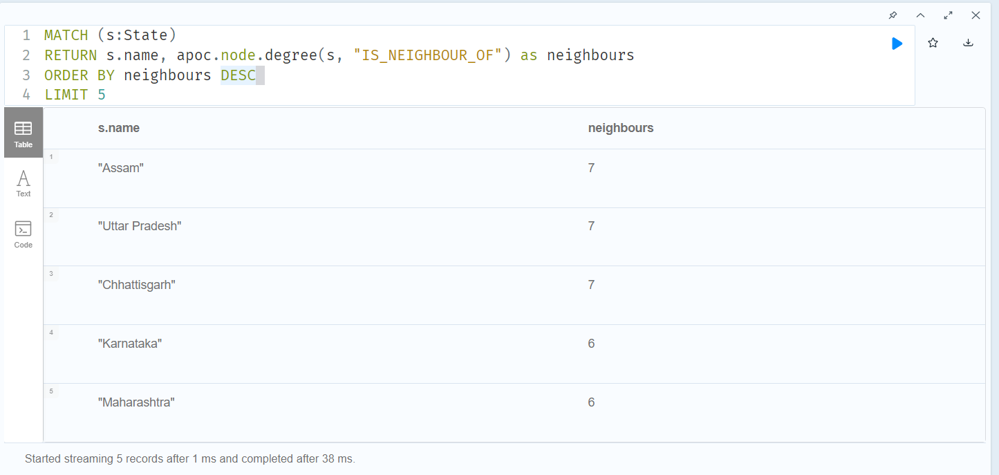
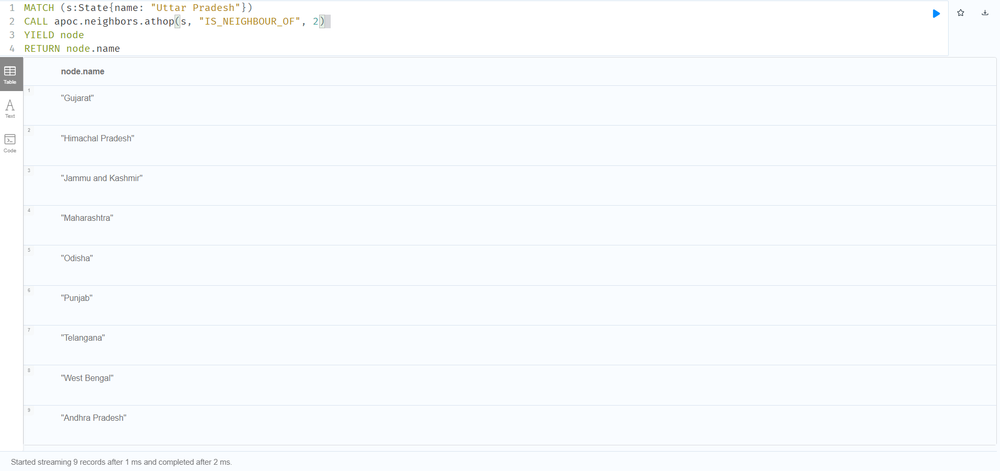

# Travel India with Neo4j

One day I was in call with my friend and we were discussing how many states do we have to cross if we have to travel from Kanpur to Pune. For that I went to google maps and found the result. Then I thought, how google maps works in the backend and shows us this result. So I tried to use Graphs in Neo4j to see how we can create a simple navigation system.


## The Graph

### Building the graph

I created a `states.json` file from Wikipedia and MapMyIndia's data, containing most of Indian states. The file can be downloaded from [here](https://gist.githubusercontent.com/shashankshukla96/f56931bcfc7dd6422bdc950f26dfc4dc/raw/states.json).

### Strucure of json file

```
[
  {
    "name": "Andhra Pradesh",
    "population": 53903393,
    "area": 160205,
    "capital": "Amaravati",
    "neighbours": [
      "Odisha",
      "Chhattisgarh",
      ...
    ],
    "cities": [
      "Visakhapatnam",
      "Vijayawada",
      "Guntur",
      "Nellore",
      ...
    }
]

```

Now, we will create the following Nodes and Edges in our neo4j database.

- State nodes with Name, Population, and an area
- City nodes with name
- Relationship IS_CAPITAL_OF between City -> State
- Relationship IS_CITY_OF between City -> State
- Relationship IS_NEIGHBOUR_OF between State -> State

Using Neo4j's **APOC** libray, we will import the json file to our neo4j database with following cypher query.

```

WITH "https://gist.githubusercontent.com/shashankshukla96/f56931bcfc7dd6422bdc950f26dfc4dc/raw/states.json" AS url
CALL apoc.load.json(url) YIELD value AS v
MERGE (s:State {name: v.name})
SET s.population = v.population, s.area = v.area
CREATE (capital:City {name: v.capital})
CREATE (s)<-[:IS_CAPITAL_OF]-(capital)
FOREACH (n IN v.neighbours |
  MERGE (neighbour:State {name: n})
  MERGE (s)<-[:IS_NEIGHBOUR_OF]->(neighbour)
)

FOREACH (cityName IN v.cities |
  MERGE (city:City {name: cityName})
  MERGE (s)<-[:IS_CITY_OF]-(city)
)

RETURN *

```

## Exploring the graph


### Top states with largest area

Let's start with a basic query and get 5 largest states in India by area and their capitals

```
MATCH (s:State)-[r:IS_CAPITAL_OF]-(c:City)
RETURN *
ORDER BY s.area DESC
LIMIT 5
```


### Top states with highest population density

```
MATCH (s:State)
RETURN s.name as name, 
        apoc.number.format(s.area) as area, 
        apoc.number.format(s.population) as population, 
        s.population/s.area as density
ORDER BY density DESC
LIMIT 5
```

*Note : “apoc.number.format()” returns a String, and to get the correct sorting we need to “ORDER BY” the numerical value.*


oh that's interesting, I knew that UP is most populated indian state, but was under the impression that UP has the most population density, but seems Bihar has higher population density.

### States with most neighbours

Now lets see, if we can find the states with most neighbours.

```
MATCH (state1:State)-[r:IS_NEIGHBOUR_OF]-(state2:State)
WITH state1, collect(state2.name) as neighbours
RETURN state1.name, neighbours, size(neighbours)
ORDER BY size(neighbours) DESC
LIMIT 5
```


We can do the same operation by finding out the degree of each state node.
The degree of a node is defined by the number of edges coming in and going out of that node. If we can find out the number of ```"IS_NEIGHBOUR_OF"``` edges from any particular state, then it will be same as our above output. We can use ```neo4j's apoc library``` for this.
 
```
MATCH (s:State) 
RETURN s.name, apoc.node.degree(s, "IS_NEIGHBOUR_OF") as neighbours
ORDER BY neighbours DESC
LIMIT 5
```



Now, let's see if we can duplicate the same result from graph for **Uttar Pradesh**.

```
MATCH (state1:State)-[r:IS_NEIGHBOUR_OF]-(state2:State)
WHERE state1.name = "Uttar Pradesh"
RETURN *
```


### How to reach from one city to another

Now let's come to our final goal, and see how we can create a navigation path from one city/state to another

For first example, we will see if how we can reach Pune from Kanpur and how many state we will need to cross.

```
MATCH (c1:City {name: "Kanpur"})
MATCH (c2: City{name: "Pune"})
MATCH p=shortestPath((c1)-[*]-(c2)) 
RETURN p
```


So, there we have found our result, to go reach Pune from Kanpur, we will have to go through Uttar Pradesh, Madhya Pradesh and Maharashtra.

**shortestPath()** will return the shortest from c1 and c2 nodes, if there are more than one paths available, in that case also it will one path. Now if we add distances between the states and cities and we can also use some graph data science algorithms like **Dikshtra's algorithm** to compute the shortest path with the distance as weights on the edges.

### Working with Hops

A hop is defined as going from one node to another using any relationship.

Now, we can easily find out which states are immediate neighbours of "Uttar Pradesh" with this following query.

```
MATCH (state1:State)-[r:IS_NEIGHBOUR_OF]-(state2:State)
WHERE state1.name = "Uttar Pradesh"
RETURN *
```


But how can we find out the 2nd or 3rd neighbouring states of "Uttar Pradesh",
to do this we can use `apoc function` `apoc.neighbours.athop` which finds the neighbourhood at specific hop count.

```
MATCH (s:State{name: "Uttar Pradesh"})
CALL apoc.neighbors.athop(s, "IS_NEIGHBOUR_OF", 2)
YIELD node
RETURN node.name
```


**Note:** With this approach if we have a Social Network like linkedin, then we can easily observe how Linkedin shows who is someone's immediate friend (Level 1 connection), or a friend of friend (Level 2 connection) and so on. 

Another application of this could be if we have a dataset of all the flight plans, then we can calculate the flight paths from Point A to Point B, in number of stops. e.g. we can filter out direct flights from A to B, or from A to B with one stop in between or more stops in between. 
 
## Conclusion

In this post, we were able to create some cypher queries to get from insights from Indian States and also able to understand how we can create a simple map application. Just add more data points as nodes and distances between them and we can create a full fledged navigation application.

